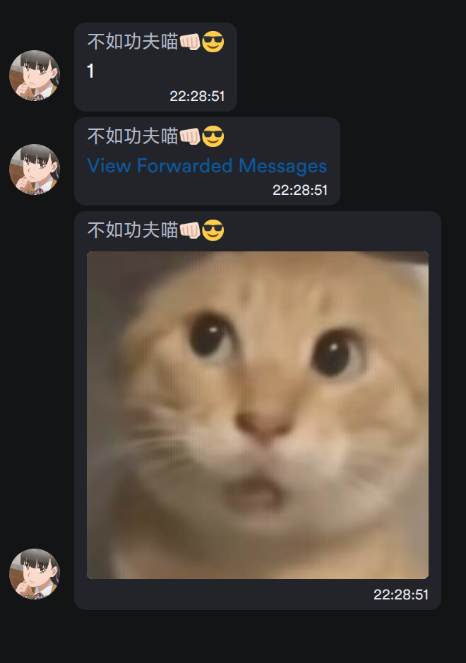
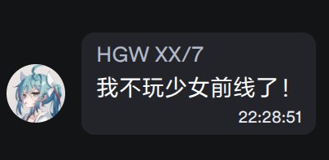

nonebot-plugin-fakemsg

_⭐基于 `Nonebot2`的 `onebot 11`的合并转发伪造消息插件⭐_

## ⭐ 介绍

## 支持图片，文字，以及嵌套转发，没有原版插件那么多配置

使用效果图如下

> 指令如下使用如下图

> 效果如下

## 💝 特别鸣谢

- [X] [原版插件](https://github.com/Cvandia/nonebot-plugin-fakemsg): 原版插件
- [X] [Nonebot](https://github.com/nonebot/nonebot2): 本项目的基础，非常好用的聊天机器人框架。
- [X] [Onebot](https://onebot.dev/): 统一的聊天机器人应用接口标准。简洁、通用、可扩展，只需使用一套标准即可为各种平台编写聊天机器人
